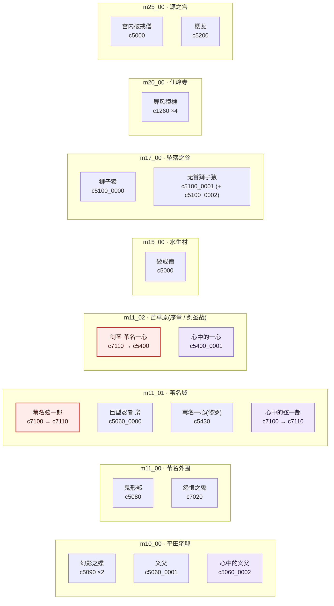
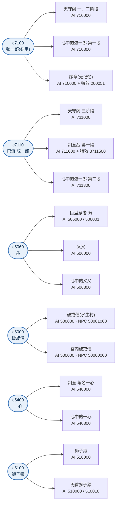
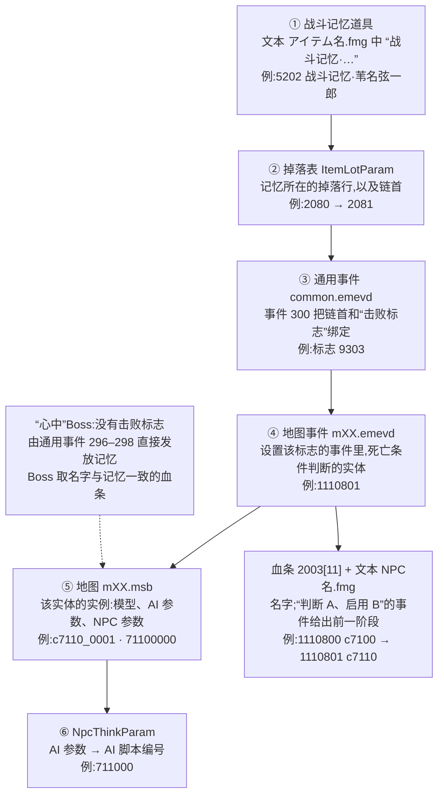

# 只狼原版 · 战斗记忆 Boss 一览

原版(1.06)里能拿到"战斗记忆"的 Boss 共 **17 个**:14 个主线 Boss,加上 1.05 版加入的 3 个"心中"Boss。每个 Boss 的地图、角色编号(`cNNNN`)、AI 脚本和击败标志都直接从游戏文件读出,证据链见[文末](#数据是怎么来的)。

| 文件 | 内容 |
|---|---|
| [`memory_bosses.csv`](memory_bosses.csv) | 本表的完整数据,由 [`scripts/ai/memory_bosses.py`](../scripts/ai/memory_bosses.py) 从游戏文件生成。每个 Boss 一行,包括实体编号、NPC 参数、血条名字编号、记忆掉落链和击败事件。 |
| [`genichiro.json`](genichiro.json) | 弦一郎在游戏里的全部实例,以及每个实例对应哪场战斗。 |

> 地图下的区域名(平田宅邸、苇名城……)是按 Boss 所在位置推断的,**不是**从文件里读出来的。地图编号本身是读出来的。

---

## 一、地图 → Boss → 角色编号

`→` 表示同一场战斗中途换了模型,比如弦一郎从 c7100 换成 c7110。紫色框是 1.05 版的"心中"Boss。



---

## 二、同一个模型,出现在多场战斗里

做招式数据时,**不能只按角色编号统计**:同一个模型在不同战斗里用的 AI 或参数不同,能出的招也不同。弦一郎就是这样。虚线是不掉记忆的战斗。



AI 写成 `logic / battle` 两个编号,只有两者不同时才写两个(见 NpcThinkParam)。

---

## 三、总表

按游戏里的记忆编号排序。"击败标志"指 Boss 被击败时设置的事件标志,通用事件 300 用它来发放记忆。

| # | 战斗记忆 | 血条名(按阶段) | 地图 | 角色编号 | AI | 击败标志 | 备注 |
|---|---|---|---|---|---|---|---|
| 1 | 鬼形部 | 鬼形部 | m11_00 | `c5080` | 508000 | 9301 | |
| 2 | 幻影之蝶 | 幻影之蝶 | m10_00 | `c5090` ×2 | 509000 | 9302 | 击败事件同时判断两个实例;事件里还有 `c7210_0000`(没有 AI,身份未查) |
| 3 | **苇名弦一郎** | 苇名弦一郎 → 巴流 苇名弦一郎 | m11_01 | **`c7100` → `c7110`** | 710000 → 711000 | 9303 | 序章弦一郎(m11_02,同样是 AI 710000)不掉记忆 |
| 4 | 屏风猿猴 | 观猴、闻猴、言猴 | m20_00 | `c1260` ×4 | 126000 | 9405 | 共用血条挂在一个不可见的 `c1000_0009` 上;击败事件不判断角色 |
| 5 | 狮子猿 | 狮子猿 | m17_00 | `c5100_0000` | 510000 | 9304 | 事件里还有 `c5001_0000`(没有 AI,身份未查) |
| 6 | 破戒僧 | 破戒僧 | m15_00 | `c5000` | 500000 | 9306 | NPC 参数 50001000 |
| 7 | 巨型忍者 枭 | 巨型忍者 枭 | m11_01 | `c5060_0000` | 506000 / 506001 | 9308 | |
| 8 | 义父 | 义父 | m10_00 | `c5060_0001` | 506000 | 9317 | 事件里还有 `c5070_0000`(AI 507000,身份未查) |
| 9 | 宫内破戒僧 | 破戒僧 | m25_00 | `c5000` | 500000 | 9309 | NPC 参数 50000000;事件里还有 3 个 `c5005`(身份未查) |
| 10 | 樱龙 | 樱龙 | m25_00 | `c5200` | 520000 | 9410 | |
| 11 | 怨恨之鬼 | 怨恨之鬼 | m11_00 | `c7020` | 702000 | 9313 | |
| 12 | **剑圣苇名一心** | 巴流 苇名弦一郎 → 剑圣 苇名一心 | m11_02 | **`c7110`** → `c5400` | 711000 → 540000 | 9312 | 巴流阶段带特效 3711500(会出 3085–3087) |
| 13 | 苇名一心 | 苇名一心 | m11_01 | `c5430` | 540000 / 543000 | 9316 | 修罗结局 |
| 14 | 无首狮子猿 | 狮子猿 | m17_00 | `c5100_0001` (+ `c5100_0002`) | 510000 / 510010 | 9307 | `c5100_0002`(AI 510000 / 510001)推测是二阶段出现的第二只猴子,没有在游戏里确认 |
| 15 | **心中的弦一郎** | 心中的弦一郎 | m11_01 | **`c7100` → `c7110`** | 710300 → 711300 | (通用事件 296) | 1.05 版 |
| 16 | 心中的义父 | 心中的义父 | m10_00 | `c5060_0002` | 506300 | (通用事件 297) | 1.05 版;同一地图另有 `c5070_0001`(AI 507300) |
| 17 | 心中的一心 | 心中的一心 | m11_02 | `c5400_0001` | 540300 | (通用事件 298) | 1.05 版 |

**还没查清的:**

- **配角身份**:`c7210`、`c5001`、`c5070`、`c5005` 只读出了编号和 AI,不知道它们在战斗里是什么。
- **区域名**:是推断的,其中 m15 和 m17 最不确定。

---

## 数据是怎么来的

每一步都是读游戏文件,没有按名字猜对应关系。



重新生成:

```text
python -I research/ground_truth/scripts/ai/memory_bosses.py research/ground_truth/characters/memory_bosses.csv
```

游戏目录读自 `research/ground_truth/local.config`,只读不写。
