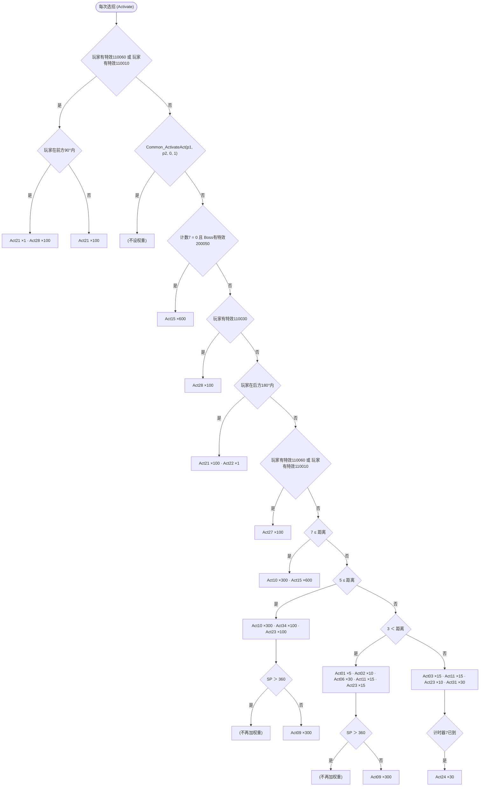
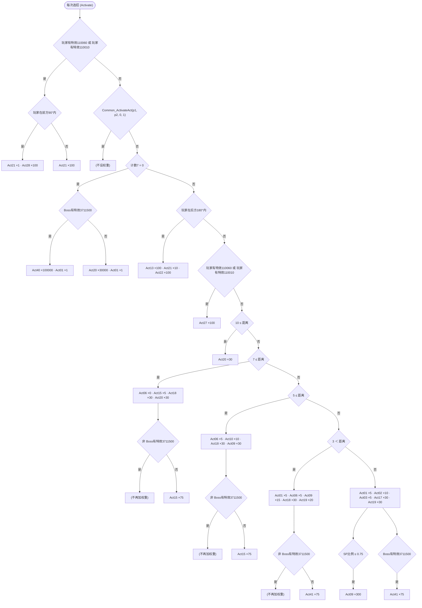

# 天守阁弦一郎的选招逻辑(原版 1.06)

这份文档由 `scripts/ai/ai_flowchart.py` 从游戏的战斗 AI 脚本自动生成,只适用于天守阁这一场战斗:

| 阶段 | 角色 | AI 脚本 | Boss 自带的相关特效 |
|---|---|---|---|
| 一、二阶段 | c7100(实体 1110800) | 710000 | 200050(没有 200051) |
| 三阶段 | c7110(实体 1110801) | 711000 | 200050(没有 3711500) |

每场弦一郎战斗用的是哪个 AI、带哪些特效,见 `characters/genichiro.json`。天守阁里每个动画能不能出、在哪个阶段出、经由哪个函数出,见 `engine/genichiro_castle_ai_reachability.csv`。

反编译出的 AI 脚本全文是游戏代码的衍生物,不提交。用 `scripts/ai/` 里的工具和本地游戏文件可以重新生成。

## 怎么读

- AI 每次要出招时运行一次 Activate:
  1. 先检查是否刚发生拼刀或弹刀。如果是,就走"拼刀后选招",不走选招流程图。
  2. 否则沿着流程图往下走,把途经方框里的权重加起来。
  3. 再做"决策链之后的权重调整"。
  4. 按权重随机选一个 Act。
  5. 执行这个 Act 请求的动画,见最后的表格。
- "打断反应"不是由 Activate 选出来的。战斗中某个触发条件成立时,AI 会立刻改出这些招。
- 条件里的数字大多原样保留,因为它们的含义还不知道:
  - "玩家有特效 X"、"Boss有特效 X":特效编号;
  - "计数 N":AI 的计数器;
  - "计时器 N":AI 的计时器。
- 已经知道含义的写成了文字:距离(米)、HP比例、SP、剩余忍杀数、随机数。
- 一、二阶段用同一个 AI,唯一的区别是"剩余忍杀数":一阶段是 2,二阶段是 1。条件里出现"剩余忍杀数 ≤ 1"的地方,就是只有二阶段才会走的分支。
- 三阶段的图里有"Boss有特效3711500"的分支。天守阁的巴流没有这个特效,所以这些分支在天守阁不会走到;剑圣战第一阶段的巴流带这个特效。

## 一、二阶段

### AI 710000(c7100)

#### 选招流程 (Activate)

先检查是否刚发生拼刀或弹刀:是的话走下面的“拼刀后选招”,不走这张图。图中每个方框是这条分支给各个 Act 加的权重,最后按权重随机选一个 Act。

#### 决策链之后的权重调整(覆盖上面的值)

- 如果 (玩家有特效109031 或 玩家有特效110125) 且 距离 ≤ 5:
  - Act16 ×100
- 如果 玩家有特效109900:
  - Act01 ×5 · Act02 ×5 · Act03 ×5 · Act09 ×0 · Act11 ×5 · Act10 ×30 · Act15 ×0 · Act31 ×0 · Act48 ×30
- 如果 计数2 = 1:
  - Act23 ×6000
- 如果 计时器0未到:
  - Act03 ×0 · Act06 ×1
- 如果 计时器1未到:
  - Act02 ×0
- 如果 计时器3未到:
  - Act24 ×0
- 如果 计时器6未到:
  - Act09 ×0
- 如果 Boss有特效200051:
  - Act15 ×0 · Act18 ×0 · Act19 ×0 · Act34 ×0 · Act48 ×0
- 如果 45°方向2m内无空间 且 -45°方向2m内无空间:
  - Act22 ×0
- 如果 90°方向1m内无空间 且 -90°方向1m内无空间:
  - Act23 ×0
- 如果 180°方向2m内无空间:
  - Act24 ×0
- 如果 180°方向1m内无空间:
  - Act25 ×0
- 如果 玩家有特效110621:
  - Act23 ×0 · Act24 ×0 · Act31 ×10

#### 拼刀后选招 (Kengeki_Activate)

“拼刀类型”是刚刚那次拼刀或弹刀留下的特效编号。每条分支给 Kengeki 函数加权重,然后按权重选一个。

- 如果 拼刀类型 = 200200:
  - 如果 2.5 ≤ 距离:
    - Kengeki50 ×100
  - 否则:
    - 如果 2 ≤ 计数0:
      - Kengeki03 ×60 · Kengeki20 ×60 · Kengeki30 ×5 · Kengeki38 ×50 · Kengeki15 ×30 · Kengeki43 ×50 · Kengeki39 ×30
      - 如果 计数6 = 0:
        - Kengeki32 ×20
      - 否则:
        - Kengeki33 ×20
    - 否则:
      - 如果 计数3 = 0:
        - Kengeki01 ×50
      - 否则:
        - Kengeki04 ×100
- 否则如果 拼刀类型 = 200201:
  - 如果 2.5 ≤ 距离:
    - Kengeki50 ×100
  - 否则:
    - 如果 2 ≤ 计数0:
      - Kengeki03 ×60 · Kengeki20 ×60 · Kengeki38 ×50 · Kengeki15 ×30 · Kengeki43 ×50 · Kengeki39 ×30
      - 如果 计数6 = 0:
        - Kengeki32 ×50
      - 否则:
        - Kengeki33 ×50
    - 否则:
      - 如果 计数3 = 0:
        - Kengeki01 ×50
      - 否则:
        - Kengeki04 ×100
- 否则如果 拼刀类型 = 200210:
  - Kengeki02 ×100 · Kengeki17 ×100 · Kengeki38 ×50 · Kengeki31 ×50
- 否则如果 拼刀类型 = 200211:
  - Kengeki02 ×100 · Kengeki10 ×50 · Kengeki31 ×50 · Kengeki38 ×50
- 否则如果 拼刀类型 = 200216:
  - 如果 2 ≤ 距离:
    - Kengeki50 ×10
  - 否则:
    - 如果 3 ≤ 计数0:
      - Kengeki03 ×60 · Kengeki20 ×20 · Kengeki38 ×100 · Kengeki43 ×50
      - 如果 计数6 = 0:
        - Kengeki32 ×50
      - 否则:
        - Kengeki33 ×50
    - 否则:
      - Kengeki20 ×50
      - 如果 计数3 = 0:
        - Kengeki01 ×50
      - 否则:
        - Kengeki14 ×50
- 否则如果 拼刀类型 = 200215:
  - 如果 2 ≤ 距离:
    - Kengeki50 ×10
  - 否则:
    - 如果 3 ≤ 计数0:
      - Kengeki20 ×20 · Kengeki38 ×30 · Kengeki31 ×15 · Kengeki43 ×10 · Kengeki39 ×10
      - 如果 计数6 = 0:
        - Kengeki32 ×50
      - 否则:
        - Kengeki33 ×50
    - 否则:
      - Kengeki20 ×50
      - 如果 计数3 = 0:
        - Kengeki01 ×50
      - 否则:
        - Kengeki14 ×50
- 如果 Boss有特效200051:
  - Kengeki03 ×0 · Kengeki09 ×0 · Kengeki15 ×0 · Kengeki32 ×0 · Kengeki33 ×0 · Kengeki39 ×0 · Kengeki46 ×0
- 否则如果 Boss有特效200050:
  - Kengeki20 ×0
- 如果 45°方向2m内无空间 且 -45°方向2m内无空间:
  - Kengeki20 ×0
- 如果 计时器6未到:
  - Kengeki40 ×0
- 否则如果 计时器6已到 且 HP比例 ≤ 0.75:
  - Kengeki40 ×50

#### 打断反应 (Interrupt)

战斗中出现某个触发条件时,立即改出这些招。

- 如果 打断:ParryTiming:
  - 转到 Parry
- 如果 打断:ActivateSpecialEffect:
  - 如果 触发特效 = 3710020: —
  - 否则如果 触发特效 = 3710030 且 Boss有特效3710032:
    - 出招 **3092** (EndureAttack)
  - 否则如果 触发特效 = 5029:
    - 转到 Damaged
  - 否则如果 触发特效 = 5031:
    - 如果 剩余忍杀数 ＞ 1 或 4.1 ＞ 距离: 跳过下面的设置
    - 否则:
      - 出招 **3017** (ComboRepeat)
  - 否则如果 触发特效 = 3710050:
    - 如果 随机1-100 ≤ 50 且 Boss有特效200050:
      - 出招 **3023** (ComboRepeat)
  - 否则如果 触发特效 = 110620:
    - 重新选招
- 如果 Interupt_Use_Item(p1, 8, 5):
  - 如果 Boss有特效200051 且 2 ≤ 剩余忍杀数: —
  - 否则:
    - 出招 **3023** (AttackTunableSpin)

#### 每个选项请求的动画

| 函数 | 动画(按顺序;方括号里是函数内部的分支) |
|---|---|
| Act01 | [随机1-100 ≤ 30: 3000 → 3001 → 3002 → 3003 ｜ 否则: 3000 → 3001 → 3010 → 3025] |
| Act02 | 3004 |
| Act03 | 3005 |
| Act05 | 3007 |
| Act06 | 3016 |
| Act09 | 3040 → 3041 |
| Act10 | 3006 |
| Act11 | 3037 → 3020 |
| Act15 | 3014 → 3015 |
| Act16 | 3022 |
| Act20 | 3062 |
| Act22 | [-45°方向2m内有空间: [45°方向2m内有空间: [玩家在右方180°内: 5202 ｜ 否则: 5203] ｜ 否则: 5202] ｜ 45°方向2m内有空间: 5203] |
| Act24 | 5201 → [SP比例 ≤ 0.7 且 Boss有特效200050: 3044] |
| Act30 | 3009 → 3044 |
| Act31 | 3003 → 3045 |
| Act34 | 3007 → 3011 |
| Act48 | 3013 → 3015 |
| Parry | [玩家在前方90°内 且 IsInsideTargetEx(TARGET_ENE_0, TARGET_SELF, AI_DIR_TYPE_F, 180, 弹刀距离): [Boss有特效3710040: 3102 ｜ 否则: [玩家有特效COMMON_SP_EFFECT_PC_ATTACK_RUSH: 3103 ｜ 否则: [玩家有特效109970: [IsTargetGuard(TARGET_SELF) 且 ReturnKengekiSpecialEffect(p0) = false: — ｜ 否则: [r11 = 2: — ｜ 否则: [r11 = 1: [随机1-100 ＞ 50: — ｜ 否则: 5211]] → [r11 ≠ 0 或 随机1-100 ＞ 100: — ｜ 否则: 3101]]]] → [玩家有特效109980: 5201 ｜ 否则: [随机1-100 ≤ Get_ConsecutiveGuardCount(p0) * p2: 3101 ｜ 否则: 3100]]]] ｜ IsInsideTargetEx(TARGET_ENE_0, TARGET_SELF, AI_DIR_TYPE_F, 90, 弹刀距离 + 1): [随机1-100 ≤ p3: 5211]] |
| Damaged | [随机1-100 ≤ 15: 5201 ｜ 随机1-100 ≤ 30 且 Boss有特效200050: 3009] |
| ShootReaction | 3100 |
| Kengeki01 | 3050 |
| Kengeki02 | 5201 → [SP比例 ≤ 0.7 且 Boss有特效200050: 3044] |
| Kengeki03 | 3009 |
| Kengeki04 | 3055 |
| Kengeki07 | 3060 |
| Kengeki09 | 3018 → 3015 |
| Kengeki10 | 3065 |
| Kengeki13 | 3075 |
| Kengeki14 | 3076 |
| Kengeki15 | 3031 → [随机1-100 ≤ 50: 3019 → 3029 ｜ 否则: 3036] |
| Kengeki17 | 3071 |
| Kengeki18 | 3004 |
| Kengeki19 | 3044 |
| Kengeki20 | 5202 → 3007 |
| Kengeki21 | 3010 |
| Kengeki30 | 3063 |
| Kengeki31 | 3068 |
| Kengeki32 | 3018 → 3015 |
| Kengeki33 | 3018 → [随机1-100 ≤ 50: 3019 → 3029 ｜ 否则: 3019] |
| Kengeki34 | 3037 → 3020 |
| Kengeki35 | 3016 |
| Kengeki38 | 3030 → [剩余忍杀数 ≤ 1: [随机1-100 ≤ 75: 3067 ｜ 否则: 3025] ｜ 否则: 3025] |
| Kengeki39 | 3034 → 3036 → 3015 |
| Kengeki40 | 3028 |
| Kengeki43 | 3062 |
| Kengeki44 | 3067 |
| Kengeki45 | 3045 |
| Kengeki46 | 3039 |
| Kengeki47 | 3038 |

## 三阶段

### AI 711000(c7110)

#### 选招流程 (Activate)

先检查是否刚发生拼刀或弹刀:是的话走下面的“拼刀后选招”,不走这张图。图中每个方框是这条分支给各个 Act 加的权重,最后按权重随机选一个 Act。

#### 决策链之后的权重调整(覆盖上面的值)

- 如果 玩家有特效109031 或 玩家有特效110125:
  - Act18 ×1e+12
- 如果 计数2 = 1:
  - Act23 ×6000
- 如果 计时器0未到:
  - Act03 ×0 · Act06 ×1
- 如果 计时器1未到:
  - Act02 ×0
- 如果 计时器3未到:
  - Act24 ×0
- 如果 玩家有特效109900:
  - Act17 ×0 · Act18 ×0 · Act20 ×0 · Act01 ×5 · Act02 ×5 · Act09 ×0 · Act03 ×5 · Act10 ×30 · Act15 ×0 · Act41 ×0 · Act48 ×30
  - 如果 距离 ≤ 4:
    - Act19 ×30
- 如果 计时器4未到 或 Boss有特效3711500:
  - Act17 ×0 · Act18 ×0 · Act19 ×0
- 如果 计时器8未到:
  - Act09 ×0 · Act40 ×0 · Act41 ×0
- 如果 计时器6未到:
  - Act09 ×0
- 如果 45°方向2m内无空间 且 -45°方向2m内无空间:
  - Act22 ×0
- 如果 90°方向1m内无空间 且 -90°方向1m内无空间:
  - Act23 ×0
- 如果 180°方向2m内无空间:
  - Act24 ×0
- 如果 180°方向1m内无空间:
  - Act25 ×0
- 如果 玩家有特效110621:
  - Act23 ×0 · Act24 ×0

#### 拼刀后选招 (Kengeki_Activate)

“拼刀类型”是刚刚那次拼刀或弹刀留下的特效编号。每条分支给 Kengeki 函数加权重,然后按权重选一个。

- 如果 拼刀类型 = 200200:
  - 如果 2.5 ≤ 距离:
    - Kengeki50 ×1 · Kengeki45 ×60 · Kengeki46 ×60
  - 否则:
    - 如果 2 ≤ 计数0:
      - Kengeki02 ×10 · Kengeki20 ×10 · Kengeki30 ×5 · Kengeki38 ×5 · Kengeki15 ×0 · Kengeki46 ×60
      - 如果 计数6 = 0:
        - Kengeki32 ×20
      - 否则:
        - Kengeki33 ×20
    - 否则:
      - 如果 计数3 = 0:
        - Kengeki01 ×50
      - 否则:
        - Kengeki04 ×100
- 否则如果 拼刀类型 = 200201:
  - 如果 2.5 ≤ 距离:
    - Kengeki50 ×1 · Kengeki45 ×60 · Kengeki46 ×60
  - 否则:
    - 如果 2 ≤ 计数0:
      - Kengeki02 ×10 · Kengeki20 ×10 · Kengeki31 ×5 · Kengeki38 ×5 · Kengeki15 ×30 · Kengeki46 ×60
      - 如果 计数6 = 0:
        - Kengeki32 ×500
      - 否则:
        - Kengeki33 ×500
    - 否则:
      - 如果 计数3 = 0:
        - Kengeki01 ×50
      - 否则:
        - Kengeki04 ×100
- 否则如果 拼刀类型 = 200205:
  - 如果 2.5 ≤ 距离:
    - Kengeki01 ×100
  - 否则:
    - 如果 距离 ≤ 1:
      - Kengeki01 ×100
    - 否则:
      - 如果 计数5 ≤ 4:
        - Kengeki01 ×100
      - 否则:
        - Kengeki30 ×500
- 否则如果 拼刀类型 = 200206:
  - 如果 计数5 ≤ 4:
    - Kengeki04 ×100 · Kengeki14 ×50
  - 否则:
    - Kengeki35 ×100
- 否则如果 拼刀类型 = 200210:
  - Kengeki17 ×100 · Kengeki38 ×50 · Kengeki31 ×50
- 否则如果 拼刀类型 = 200211:
  - Kengeki31 ×50 · Kengeki38 ×50
- 否则如果 拼刀类型 = 200216:
  - 如果 3 ≤ 距离:
    - Kengeki50 ×10
  - 否则:
    - 如果 2 ≤ 计数0:
      - Kengeki20 ×20 · Kengeki30 ×45 · Kengeki38 ×30 · Kengeki43 ×10 · Kengeki44 ×10 · Kengeki46 ×60 · Kengeki39 ×10 · Kengeki15 ×10
      - 如果 计数6 = 0:
        - Kengeki32 ×50
      - 否则:
        - Kengeki33 ×50
    - 否则:
      - Kengeki20 ×50 · Kengeki50 ×100
      - 如果 计数3 = 0:
        - Kengeki01 ×50
      - 否则:
        - Kengeki14 ×50
- 否则如果 拼刀类型 = 200215:
  - 如果 3 ≤ 距离:
    - Kengeki50 ×10
  - 否则:
    - 如果 2 ≤ 计数0:
      - Kengeki20 ×20 · Kengeki38 ×30 · Kengeki31 ×15 · Kengeki43 ×10 · Kengeki44 ×10 · Kengeki39 ×10 · Kengeki15 ×10 · Kengeki46 ×60
      - 如果 计数6 = 0:
        - Kengeki32 ×50
      - 否则:
        - Kengeki33 ×50
    - 否则:
      - Kengeki20 ×50 · Kengeki46 ×100 · Kengeki50 ×100
      - 如果 计数3 = 0:
        - Kengeki01 ×50
      - 否则:
        - Kengeki14 ×50
- 如果 45°方向2m内无空间 且 -45°方向2m内无空间:
  - Kengeki20 ×0
- 如果 计时器4未到:
  - Kengeki45 ×0 · Kengeki46 ×0
- 如果 Boss有特效3711500:
  - Kengeki32 ×0 · Kengeki33 ×0 · Kengeki45 ×0 · Kengeki46 ×0 · Kengeki47 ×0
  - 如果 计时器8已到:
    - Kengeki22 ×100
- 如果 计时器6未到:
  - Kengeki40 ×0
- 否则如果 计时器6已到 且 HP比例 ≤ 0.75:
  - Kengeki40 ×50

#### 打断反应 (Interrupt)

战斗中出现某个触发条件时,立即改出这些招。

- 如果 打断:ParryTiming:
  - 转到 Parry
- 如果 打断:Shoot:
  - 转到 ShootReaction
- 如果 打断:ActivateSpecialEffect:
  - 如果 触发特效 = 5026:
    - 如果 距离 ＞ 5.2 + 0.3 或 随机1-100 ＞ 0: 跳过下面的设置
    - 否则:
      - 出招 **3016** (EndureAttack)
  - 否则如果 触发特效 = 5029:
    - 如果 Boss有特效3711500 且 3 ≤ 距离 且 距离 ≤ 8:
      - 出招 **3085** (ComboRepeat)
    - 否则:
      - 如果 5.5 ≤ 距离 且 距离 ≤ 11:
        - 出招 **3008** (ComboFinal)
      - 否则:
        - 如果 11 ＞ 距离: 跳过下面的设置
        - 否则:
          - 出招 **3018** (ComboRepeat)
  - 否则如果 触发特效 = 5031:
    - 如果 距离 ＞ 6.5 或 随机1-100 ＞ 50: 跳过下面的设置
    - 否则:
      - 出招 **3086** (ComboRepeat)
  - 否则如果 触发特效 = 3710020: —
  - 否则如果 触发特效 = 3710030 且 Boss有特效3710032:
    - 出招 **3092** (EndureAttack)
  - 否则如果 触发特效 = 3711000:
    - 出招 **3009** (ComboFinal)
  - 否则如果 触发特效 = 109031 或 触发特效 = 110125:
    - 如果 随机1-100 ＞ 50: 跳过下面的设置
    - 否则:
      - 重新选招
  - 否则如果 触发特效 = 5030 且 随机1-100 ≤ 100:
    - 出招 **3080** (ComboRepeat)
- 如果 打断:InactivateSpecialEffect:
  - 如果 解除特效 = 109031 或 解除特效 = 110125:
    - 重新选招
  - 否则如果 解除特效 = 110010:
    - 重新选招
- 如果 Interupt_Use_Item(p1, TIMER_ITEM_USED, 5):
  - 如果 距离 ≤ 12.5:
    - 出招 **3008** (AttackTunableSpin)
  - 否则:
    - 重新选招

#### 每个选项请求的动画

| 函数 | 动画(按顺序;方括号里是函数内部的分支) |
|---|---|
| Act01 | [随机1-100 ≤ 70: 3000 → 3001 → 3002 → 3003 ｜ 否则: 3000 → 3001 → 3010 → 3025] |
| Act02 | 3004 |
| Act03 | 3005 |
| Act05 | 3007 |
| Act06 | 3016 |
| Act07 | 3020 |
| Act08 | 3021 |
| Act09 | 3040 → 3041 → [Boss有特效3711500: 3086 ｜ 否则: 3067] |
| Act10 | 3006 |
| Act11 | 3021 |
| Act12 | 3037 → 3021 |
| Act13 | 3012 → [计时器4已到 且 非 Boss有特效3711500: 3039] |
| Act15 | 3014 → [Boss有特效3711500 且 计时器8已到: 3087 ｜ 否则: 3015] |
| Act16 | 3022 |
| Act17 | 3039 |
| Act18 | 3043 |
| Act19 | 3042 |
| Act20 | 3008 |
| Act31 | 3003 → 3045 |
| Act22 | [-45°方向2m内有空间: [45°方向2m内有空间: [玩家在右方180°内: 5202 ｜ 否则: 5203] ｜ 否则: 5202] ｜ 45°方向2m内有空间: 5203] |
| Act24 | 5201 |
| Act34 | 3007 → 3011 |
| Act30 | 3008 → 3009 |
| Act40 | 3085 |
| Act41 | 3003 → 3045 → 3085 |
| Act42 | 3014 → 3085 |
| Act43 | 3036 → 3085 |
| Act44 | 3008 → 3085 |
| Act45 | 3008 → 3085 |
| Act48 | 3013 → [Boss有特效3711500 且 计时器8已到: 3087 ｜ 否则: 3015] |
| Parry | [玩家在前方90°内 且 IsInsideTargetEx(TARGET_ENE_0, TARGET_SELF, AI_DIR_TYPE_F, 180, 弹刀距离): [玩家有特效COMMON_SP_EFFECT_PC_ATTACK_RUSH: 3103 ｜ 否则: [玩家有特效109970: [IsTargetGuard(TARGET_SELF) 且 ReturnKengekiSpecialEffect(p0) = false: — ｜ 否则: [r11 = 2: — ｜ 否则: [r11 = 1: [随机1-100 ＞ 50: — ｜ 否则: 5211]] → [r11 ≠ 0 或 随机1-100 ＞ 100: — ｜ 否则: 3101]]]] → [玩家有特效109980: 5201 ｜ 否则: [随机1-100 ≤ Get_ConsecutiveGuardCount(p0) * p2: 3101 ｜ 否则: 3100]]] ｜ IsInsideTargetEx(TARGET_ENE_0, TARGET_SELF, AI_DIR_TYPE_F, 90, 弹刀距离 + 1): [随机1-100 ≤ p3: 5211]] |
| Damaged | [随机1-100 ≤ 15: 5201 ｜ 随机1-100 ≤ 30 且 Boss有特效200050: 3009] |
| ShootReaction | 3100 |
| Kengeki01 | 3050 |
| Kengeki02 | 5201 |
| Kengeki04 | 3055 |
| Kengeki07 | 3060 |
| Kengeki09 | 3018 → 3043 |
| Kengeki10 | 3065 |
| Kengeki13 | 3075 |
| Kengeki14 | 3076 |
| Kengeki15 | 3031 → [随机1-100 ≤ 50: 3019 → 3029 ｜ 否则: 3036] |
| Kengeki17 | 3076 |
| Kengeki18 | 3004 |
| Kengeki20 | 5202 → 3007 |
| Kengeki21 | 3010 |
| Kengeki22 | 3018 → 3087 |
| Kengeki30 | 3063 |
| Kengeki31 | 3068 |
| Kengeki32 | 3018 → 3043 |
| Kengeki33 | 3018 → [随机1-100 ≤ 50: 3019 → 3029 ｜ 否则: 3019] |
| Kengeki34 | 3037 → 3020 |
| Kengeki35 | 3016 |
| Kengeki38 | 3030 → [随机1-100 ≤ 33: 3067 ｜ 随机1-100 ≤ 66: 3025 ｜ 否则: 3032] |
| Kengeki39 | 3034 → 3036 → 3015 |
| Kengeki40 | 3028 |
| Kengeki41 | 3020 |
| Kengeki43 | 3062 |
| Kengeki44 | 3067 |
| Kengeki45 | 3042 |
| Kengeki46 | 3039 |
| Kengeki47 | 3043 |

